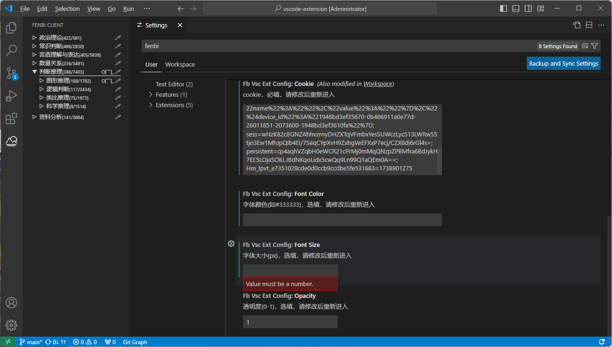
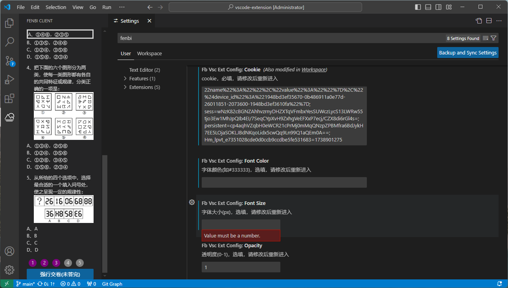
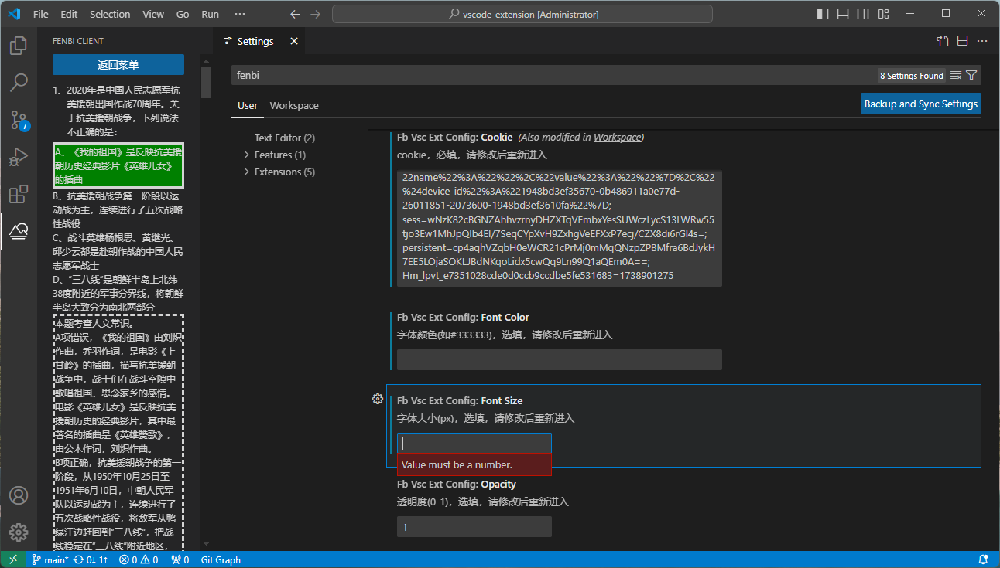

  fenbi-client - 用于 “粉笔” 刷题的客户端

## 简介
fenbi-client 是一系列用于“粉笔”刷题的客户端，目前暂时实现了客户端vscode插件

1. 源码仓库：[Github](https://github.com/maoguy/fenbi-client)
2. 下载地址：[Github Releases](https://github.com/maoguy/fenbi-client/releases)

## vscode插件截图

## 用法
下载 .vsix 文件直接安装
